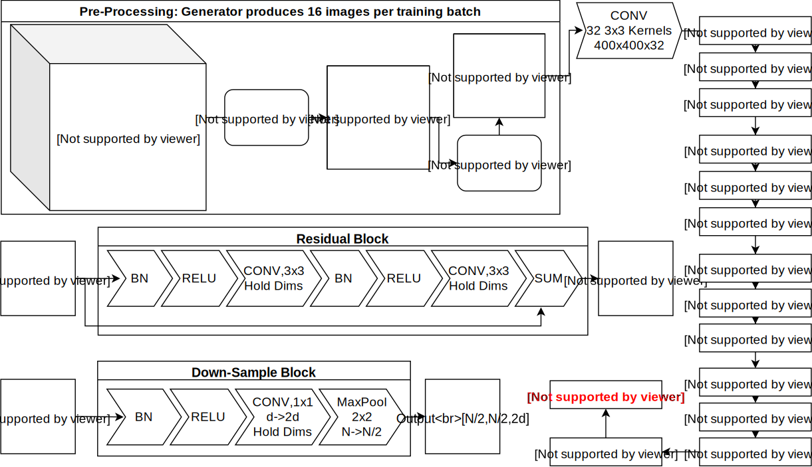

#RSNA Pneumonia Detection Challenge

Below is a write for the Kaggle competition, RSNA Pneumonia Detection Challenge.  The goal of this write up is to serve as a tutorial for how the kernel can be implemented to predict if DICOM images of patient’s chest indicate pneumonia.  Furthermore, justifications for how the model was specified are provided below.

#Importing the Kernel and Data

To import the Kernel into google colab, use the link: https://github.com/chonorat/Pneumonia

The first procedure in the kernel automatically imports and unzips the train images, test images, train labels, and class info documents from the Kaggle competition page.

#Data Visualizations

After merging the training labels and class info from the csv’s provided, the kernel extracts patient information from the DICOM images such as Age and Sex.

The kernel then plots the rate of pneumonia between males and females and an age histogram of patients with pneumonia and not with pneumonia.  No discernable differences were present in either of these comparisons.

The images are then cropped in order to improve efficiency and accuracy of the neural network.  A sample image is then displayed which shows the original image and bounding boxes along with the new cropped image and bounding boxes.

#Pneumonia Dictionary

Creates a dictionary of all pneumonia locations and adjusts the bounding box coordinates to reflect the image cropping.

#Data Generator Class

The Data Generator feeds formatted data to the network for training.  The generator samples batches of the specified batch size, crops the images, resizes the images, and creates a mask for the image.  Masks for images with pneumonia have the value 1 on the area of the bounding box and the value 0 everywhere else.  Masks without a bounding box consist entirely of 0.

#Neural Network

The CNN design is based on the Residual Network principle. In this simple application of a ResNet, there are 8 residual blocks each containing 2 convolution layers, 4 Pooling blocks each with 1 convolution layer,an initializing convolution, and a flattenning convolution giving this network a total depth of 23 convolution layers. This design included a downsample (MaxPool) for every 2 redidual block. This network is designed around an input image size of 400x400. The Output is a 400x400 pneumonia map.

#Loss Function

Intersection over union is a measure of how accurately a bounding box represents its target. Intersection is the part of the estimated box that is correct. Union is the portion of the estimated box outside the correct region. The goal of an IoU loss function is to maximize this value such that the estimated bounding box contains the correct region while aiming to restrict the box tightly to the target.

#Predictions

After the model trains, the kernel outputs predictions for the validation set along with predicted bounding boxes in blue and candidate regions in red for the fist batch.

Finally, the model is called to make predictions for the 3000 test images.  These predictions are saved to a CSV in the folder ‘/content/predictions.csv’.

#Performace

The model was fully trained and developed but performed poorly due to a technical flaw which was overlooked. The flaw is that after cropping, the bounding box labels were not updated to correspond to the new images. Accuracies were sub 90%. This problem was resolved with a corrected generator which updated the dictionary values to reflect the cropping operation. The final model performs better than before the error was corrected. The model was simultaniously run for 200x200 input image size and 32 batch size and for 400x400 input size with 16 batch size. Unfortunately, even though these tests were run in parallel on two computers, each ran into snags which terminated due to reasons unrelated to the model and setup. What we know is that for the 200x200 simulation achieved 94% accuracy after 3  epochs . The 400x400 simulation achieved 95% accuracy after 5 epochs. Although we didnt get the model to be fully trained (15-25 epochs) we are confident in the robustness of this model.
